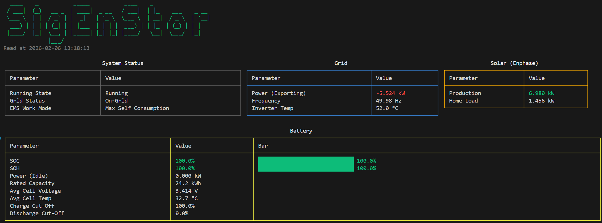

# sig-modbus

F# script that reads live data from a [Sigenergy SigEnStor](https://www.sigenergy.com/) battery ESS via Modbus TCP and displays it with color-coded tables in the terminal.

## Screenshot



## Prerequisites

- [.NET SDK](https://dotnet.microsoft.com/download) 6.0 or later
- SigEnStor with Modbus TCP Server enabled (via MySigen app)

## Usage

1. Edit `battery.fsx` and set your SigEnStor IP address on line 28
2. Run:

```
dotnet fsi battery.fsx
```

## What it shows

- **System Status** — running state, grid status, EMS work mode
- **Grid** — import/export power, frequency, inverter temperature
- **Solar (Enphase)** — inferred production from energy balance, home load
- **Battery** — SOC and SOH with progress bars, charge/discharge power, rated capacity, cell voltage, cell temperature, charge/discharge cutoffs

### Inferred Solar

Solar production from the external Enphase system is inferred from the SigEnStor's grid sensor:

```
Solar = Total Load + Battery Charge - Grid Import
```

## Tech Stack

- **NModbus** — Modbus TCP communication
- **FsToolkit.ErrorHandling** — Railway Oriented Programming with `taskResult` computation expression
- **Spectre.Console** — terminal tables, progress bars, color markup
